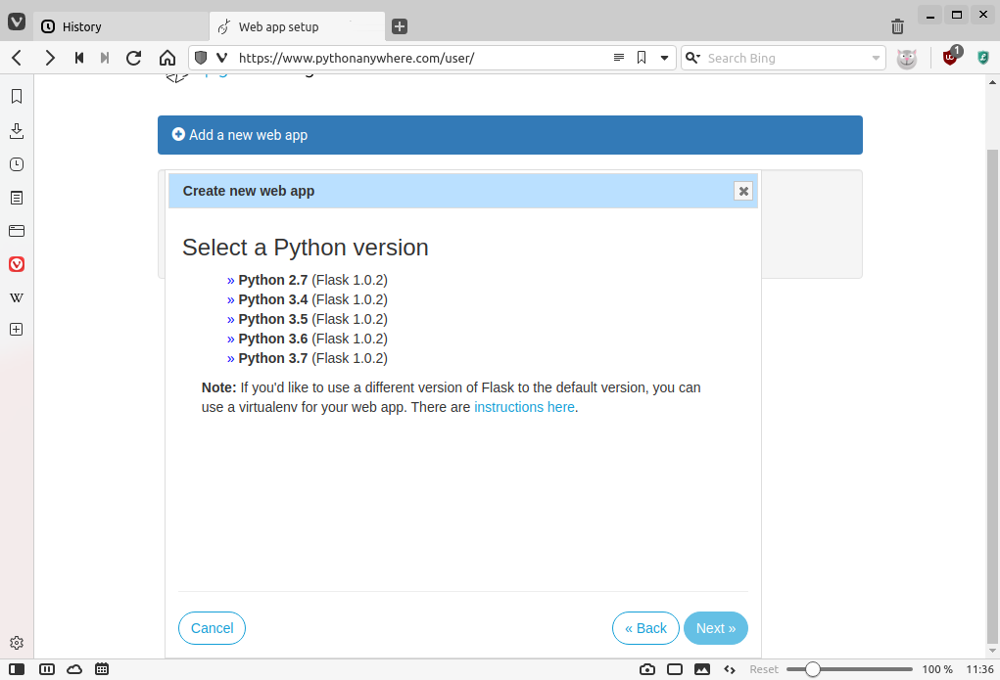
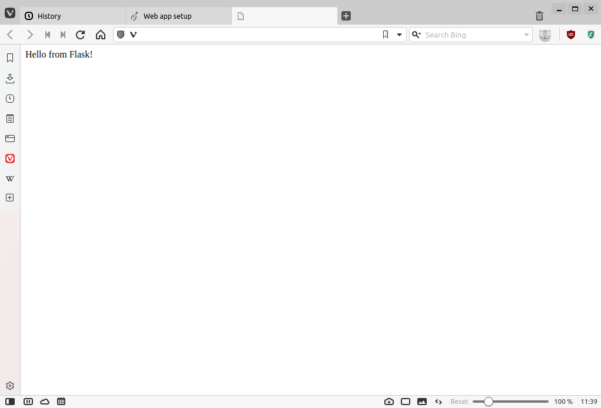

Python is an incredibly popular language for web development. If you're interested in learning it or just want to experiment with incorporating Python into your projects, the quick-and-easy service PythonAnywhere will help get you started.

### Host Python Web App

To use PythonAnywhere, all you need is a web browser and about 5 minutes of your time (and if you're on a slow internet connection, maybe some patience as well). Just follow these simple steps:

Go to [PythonAnywhere](https://www.pythonanywhere.com/?affiliate_id=00535ced).

Sign up for a free account and fill out your details.

Then click on "open web apps".


Then click on "add a new web app".


You'll see a page that lets you configure your app:

This page allows you to configure the Web framework you want to use. There are many different frameworks like Django, web2py, Flask, Bottle and others.

For simplicity, I'll go with Flask.


Then it lets you select your Python version. Go for the newest version.



Finally enter a Path for your Python file and click next. That sets up your Python web app and it is now hosted and online!



You can then open the source for of your web app. Either through the bash console or the web interface. They provide an online editor.


### Flask web app

By creating a web app, they automatically created a template for the Flask web app. The template looks like this:

```python
# A very simple Flask Hello World app for you to get started with...

from flask import Flask

app = Flask(__name__)

@app.route('/')
def hello_world():
    return 'Hello from Flask!'
```

The first line of code simply loads the Flask module.

```python
from flask import Flask
```

Then the app is created

```python
app = Flask(__name__)
```

Then a route is created. A route is mapping of a link to a Python function. In the case the / link is called, Python will execute the function hello_world(). The return value is shown in the browser.

```python
@app.route('/')
def hello_world():
    return 'Hello from Flask!'
```

You can change this value to anything you want. If you return html tags, the browser will simply render html.

You can add as many routes as you want. Every web url has the map to a unique Python function, for example try this:

```python
@app.route('/')
def hello_world():
    return 'Hello from Flask!'

@app.route('/html')
def html():
    return '<h1>html</h1>'

@app.route('/image')
def image():
    return "'
`````

Of course there's a lot more you can do with the Python Flask framework, these are just the absolute basics.

## Flask routing

A url route is a mapping between an HTTP verb and an endpoint. The endpoint can be a resource, such as a file or script, or it can be a function that processes the request.

In Flask, routes are defined in the app object. Each route is associated with a handler, which is a Python function that takes an incoming request and produces an outgoing response.

The first argument to the route decorator is the path of the URL. This can be a static string, or it can contain variable parts enclosed in angle brackets (<>). Variable parts are converted to positional arguments in the handler function.

The second argument optional, and if provided it must be one of the HTTP calls 'GET', 'POST', 'PUT', 'DELETE', 'PATCH' or 'OPTIONS'.

```python
@appFlask.route('/my-form', methods=['GET', 'POST'])
```

The example below creates a web form that supports both HTTP GET and HTTP POST request. When loading the page it uses a GET request, when you fill in the form it sends a HTTP POST request.

```python
from flask import Flask, request
appFlask = Flask(__name__)

@appFlask.route('/my-form', methods=['GET', 'POST'])
def my_form():
    # handle the POST request
    if request.method == 'POST':
        name = request.form.get('name')
        job = request.form.get('Job')
        return '<h1>The Employee Name is: {}</h1><h1>The Job is: {}</h1>'''.format(name, job)
    else:
        # handle the GET request
        return '<form method="POST"><div><label>Employee Name: <input type="text" name="name"></label></div><div><label>Job: <input type="text" name="Job"></label></div><input type="submit" value="Submit"></form>'

if __name__ == '__main__':
    appFlask.run(debug = True)
```

The web browser will always send GET requests when you call an url and return data


But when you submit a form, it doesn't send a GET request but a POST request instead.


## Bash terminal

You can click on "Open Bash console here". This lets you run [Linux Bash commands](https://bsdnerds.org/what-is-linux-shell/). Bash is the default shell on various Linux distributions and macOS. 

Bash is a command processor that typically runs in a text window, where the user types commands that cause actions. 

Bash can also read commands from a file, called a bash script. The name originally stood for Bourne-again shell, a pun on Stephen Bourne, the author of the direct ancestor of the current Unix shell.

If you want to, you can use a Linux editor like vim directly from the console window.

If you want to use SSH access and push directly from your git repository, you'll need a paid account. There's a [guide](https://blog.pythonanywhere.com/87/) on that.

